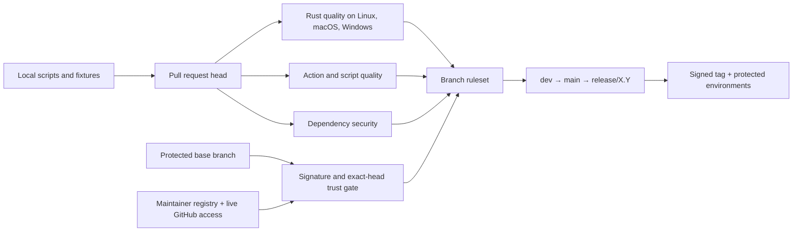
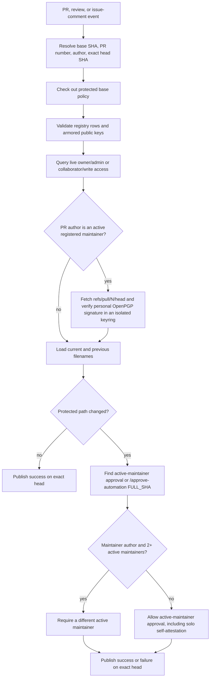

# Gitserious CI/CD Posture

> This document is the source of truth for continuous integration, automation
> trust, dependency security, and hosted merge/deployment controls. Tracked
> workflow code describes intended machinery; only a live GitHub settings audit
> proves hosted enforcement. [`RELEASE_POSTURE.md`](RELEASE_POSTURE.md) remains
> authoritative for detailed release operation and publication recovery.

## Posture at a Glance

Gitserious uses two cooperating control planes:

1. The repository owns portable scripts, fixture tests, workflow definitions,
   pinned dependencies, the maintainer/key registry, and release policy.
2. GitHub owns rulesets, required status contexts, Action allowlisting and SHA
   enforcement, deployment environments, secrets, immutable Releases, and the
   live collaborator-access signal.

Neither plane is sufficient by itself. A tracked `required` check is only a
name until a ruleset requires it; a hosted rule is only useful while the
workflow producing its evidence remains trustworthy. Sensitive changes
therefore require exact-head maintainer approval, and maintainer-authored pull
request heads additionally require a registered personal OpenPGP signature.

The ordinary quality aggregate is `ci-pass`. Automation, dependency, and trust
checks intentionally remain separate required contexts so a green Rust build
cannot hide a supply-chain or authorization failure.

## Local Entrypoints and the `justfile`

The `justfile` is a convenience interface, not an independent policy engine.
Its recipes call the same scripts used by hosted workflows:

| Recipe | What it runs | What it does not prove |
| --- | --- | --- |
| `just ci-check` | Locked Cargo metadata and `cargo check` for the workspace, all targets, and all features | Other quality categories or hosted runner coverage |
| `just ci-fmt` | `cargo fmt --all --check` | Lint or tests |
| `just ci-lint` | Locked workspace Clippy with warnings denied | Tests or dependency advisories |
| `just ci-test` | Locked workspace tests plus doctests | Formatting, Clippy, or hosted policy |
| `just ci` | Check, format, lint, tests, and doctests sequentially through `scripts/ci/check-merge-into-dev.sh` | The entire hosted pipeline |
| `just ci-fixtures` | All fixture tests colocated under `scripts/ci/tests/` | Rust matrices, live APIs, rulesets, environments, or publication |

The slightly confusing part is `just ci`: despite the name, it is the complete
local Rust-quality loop, not a local simulation of GitHub Actions. It does not
run actionlint, ShellCheck, zizmor, `cargo audit`, dependency review, native
release builders, release readiness, or trusted-review API checks. Those jobs
need their own tools, runner operating systems, GitHub event data, or hosted
controls. Keeping `just ci` narrow makes it fast and deterministic while the
more explicit `ci-fixtures` recipe exercises portable policy helpers.

## Workflow and Check Matrix

| Workflow | Trigger and purpose | Stable evidence |
| --- | --- | --- |
| `ci.yml` | Pull requests and pushes for `dev`, `main`, and `release/*`; enforces ref topology and orchestrates product quality | `ci-pass` |
| `check-code.yml` | Reusable locked `cargo check` matrix on Linux, macOS, and Windows | Component of `ci-pass` |
| `check-fmt.yml` | Reusable Rust formatting check on Ubuntu | Component of `ci-pass` |
| `check-lint.yml` | Reusable Clippy check with warnings denied | Component of `ci-pass` |
| `test.yml` | Reusable locked tests and doctests on Linux, macOS, and Windows | Component of `ci-pass` |
| `automation-quality.yml` | Reusable workflow syntax, shell, policy-fixture, CI-fixture, and zizmor analysis | `automation-quality / automation-quality` |
| `dependency-security.yml` | Called for pull requests; also runs on relevant protected pushes, daily schedule, and manual dispatch | `dependency-security / dependency-security` |
| `trusted-automation-review.yml` | Base-owned `pull_request_target`, review, and issue-comment trust evaluation | Exact-head commit status `trusted-automation-review` |
| `release-readiness.yml` | Promotion readiness and manual release rehearsal; verifies a selected real tag before checkout | `release-readiness / release-readiness` where required |
| `build-release-binaries.yml` | Reusable four-native-target build, execution, and archive matrix | `native-four`, consumed by `ci-pass` or release orchestration |
| `prepare-release.yml` | Protected manual creation of `release/X.Y` from validated `main` | `release-branch-management` deployment approval and run log |
| `release.yml` | Tag-push dry run or manual RC/stable publication | Request validation, signed-tag verification, release checks, protected deployment records |
| `update-homebrew-tap.yml` | Stable source-release handoff to a tap PR, including manual retry | `homebrew-tap-release` deployment record; tap owns its own `formula-ci` |
| `archive-topic-branch.yml` | Manual, read-only archive of a reviewed topic PR | Retained Actions artifact, not a merge or release gate |

`ci-pass` requires ref-policy, check, format, lint, test, and any promotion-only
package/native jobs that should run for the target branch. The small aggregate
script accepts an explicitly named job as skipped only when the caller's event
legitimately excludes it. The automation and dependency workflows use the same
fail-closed aggregate pattern for their internal jobs.

Security-critical trust fixtures are intentionally run twice:

- `automation-quality.yml` runs the complete `scripts/ci/tests/run.sh` suite as
  a visible `ci-script-fixtures` job; and
- `trusted-automation-review.yml` runs its exact-head status and review fixtures
  from protected code immediately before evaluating a live pull request.

The second execution protects the trust gate from silently reporting an invalid
result even if another aggregate is misconfigured.

## Trusted Automation Review

The trust workflow uses `pull_request_target` only because it must read review
and comment state and publish a status on an exact pull-request head. It never
checks out or executes pull-request code. The validator, registry, fixtures,
and status reporter come from protected base/default-branch state.

The required context is a commit status written directly to the PR head. The
workflow first marks it pending and later writes success or failure. Pushing a
new commit creates a new head and intentionally invalidates the old evidence.
The workflow run itself may finish after successfully reporting a blocked
decision; the required `trusted-automation-review` commit status is the merge
authority.

### Maintainer and contributor behavior

- Every pull request authored by an active registered maintainer must have a
  valid personal OpenPGP signature on its exact head, even if it changes only
  documentation.
- A maintainer-authored sensitive pull request also needs exact-head approval.
  With one active maintainer, solo self-attestation is allowed. With two or
  more, the author is excluded and another active maintainer must approve.
- An external contributor does not need a personal signature. If their pull
  request changes a sensitive path, an active registered maintainer must still
  approve the exact head.
- Either a GitHub approving review whose `commit_id` is the current head or the
  exact comment `/approve-automation <full 40-character SHA>` is accepted.
  Stale, dismissed, superseded, malformed, or unregistered approvals fail.
- `author_association` is retained for diagnostics but does not grant trust.
  A broad `COLLABORATOR` label is not an approval allowlist.

Never have automation generate `/approve-automation`. It is a human statement
about a specific reviewed tree.

## Protected Path Policy

The path gate protects inputs that can change compiled behavior, dependency
resolution, CI authority, build behavior, or future trust decisions:

| Category | Protected paths |
| --- | --- |
| GitHub automation | `.github/workflows/**`, `.github/actions/**`, `.github/dependabot.yml`, `.github/zizmor.yml` |
| Maintainer authority | `.github/maintainers/**` |
| Executable repository policy | all of `scripts/**` |
| Rust source and dependency inputs | every `*.rs`, root and nested `Cargo.toml`, and `Cargo.lock` |
| Toolchain, lint, and formatting | `rust-toolchain.toml`, `clippy.toml`, `rustfmt.toml`, and `.cargo/**` |
| Developer/build entrypoints | `justfile`/`Justfile`, Dockerfiles at any depth, Makefiles, and Taskfiles |

The changed-file feed includes both the new filename and GitHub's
`previous_filename`, so renaming a protected file out of the boundary does not
evade approval. Fixture coverage enumerates every category.

Ordinary documentation, issue templates, and community metadata remain outside
the sensitive path boundary. That keeps typo and prose fixes tractable without
weakening the personal-signature rule for maintainer-authored heads.

Generated release artifacts are also outside this tracked path gate because
they are outputs, not reviewed source. Their integrity is instead bound by
individual SHA-256 files, `SHA256SUMS`, `release-manifest.json`, provenance
attestations, protected environments, immutable tags, and immutable Releases.

## Maintainer Registry and OpenPGP Signing

`.github/maintainers/registry.tsv` is the base-owned authority mapping a
lowercase GitHub login to one or more full primary OpenPGP fingerprints and
armored public-key paths. The bootstrap entry is:

| GitHub login | Primary fingerprint |
| --- | --- |
| `markyjordan` | `6A04F89D74210E5922AB916BFA77CAC10AB52129` |

A syntactically valid registry row is not automatically active. The workflow
also queries the repository collaborator endpoint and requires owner/admin or
collaborator/write access. Loss of hosted write access therefore revokes trust
immediately even before a registry-cleanup pull request merges. This extra
registry is necessary because a personal-account repository exposes only owner
and collaborator roles rather than a granular maintainer role.

Registry validation fails closed for malformed rows, missing keys, fingerprint
mismatches, duplicate login/fingerprint pairs, a fingerprint assigned to
multiple logins, path traversal, or an empty registry. Signature checks import
only approved public keys into a new temporary keyring and call Git's native
`verify-commit` or `verify-tag` command.

### Key addition, rotation, and removal

1. Verify a new public key and its full primary fingerprint out of band.
2. Add a new registry row and armored public key through a signed pull-request
   head and the ordinary sensitive-path approval gate.
3. During rotation, keep both fingerprints under the same login until new work
   is consistently signed by the new key. The registry supports multiple keys
   per login.
4. Remove an old key in another reviewed change. Keep historical keys when old
   tag reruns must remain verifiable; remove a compromised key immediately and
   treat affected signatures as untrusted.
5. When a maintainer leaves, revoke repository access first, then remove their
   registry rows and environment-reviewer assignment.

GitHub-generated squash or merge commits may remain verified with GitHub's
`web-flow` key. No ruleset-wide signed-commit requirement or DCO is introduced.
The personal-key boundary applies to maintainer pull-request heads and release
tags, where the project needs to bind human authority to the exact source tree.

### Release tags

Every `vX.Y.Z-rcN` and `vX.Y.Z` used by release automation must be an annotated
tag signed by a key registered to an active maintainer. The release validator
and manual release-readiness/Homebrew retry paths check the tag from protected
default-branch code before checking out or executing tagged source. Unsigned
annotated tags, lightweight tags, unknown keys, and keys belonging to an
inactive maintainer fail.

Branch-based `tag=dry-run` rehearsals do not need a tag signature. The first
real enforcement proof will use the first intentional RC or stable tag; do not
create a disposable immutable `v*` tag just to test the gate.

## Dependency and Automation Security

The dependency posture is layered because no single scanner covers Rust
packages, workflow logic, third-party Actions, downloaded tools, and release
outputs.

### Rust dependency graph

- `Cargo.lock` is committed, protected, and required by CI.
- Cargo metadata, checks, Clippy, tests, builds, packages, and audits use locked
  resolution.
- `actions/dependency-review-action` examines pull-request dependency deltas and
  fails for vulnerabilities at `low` severity or above. License checking is
  currently outside this job.
- `cargo-audit` 0.22.2 scans the committed lockfile on pull requests, relevant
  protected pushes, a daily schedule, and manual dispatch.
- Dependabot security updates are enabled for Cargo and GitHub Actions. Routine
  version-update pull requests are disabled with `open-pull-requests-limit: 0`;
  advisory remediation stays human-reviewed through `dev`.

Detailed advisory intake, remediation timing, backports, and disclosure policy
remain in [`docs/security/DEPENDABOT.md`](../security/DEPENDABOT.md).

### GitHub Actions and workflow dependencies

- Every external `uses:` reference is a full commit SHA with a nearby reviewed
  version comment.
- GitHub's repository policy rejects non-SHA references. The Action allowlist
  admits GitHub-owned Actions and the explicitly selected
  `zizmorcore/zizmor-action`; local reusable workflows remain available.
- actionlint 1.7.12 validates workflow syntax and expressions.
- ShellCheck 0.11.0 validates repository shell scripts.
- Sensitive workflow, Action, script, pin, and registry changes require the
  trusted exact-head gate described above.

### zizmor

The repository already uses zizmor's officially recommended GitHub Actions
integration. `zizmorcore/zizmor-action` v0.6.2 remains pinned at
`3dc1ecc9bcb9e94e9b2c709687979e1298497054`, and the wrapper selects analyzer
version 1.29.0. This is not an antiquated `pip`/`uv` installer to retire; the
wrapper and analyzer are separate versioned layers.

The hosted scan uses the pedantic persona, all audit collections, online
audits, medium confidence/severity blocking thresholds, fail-on-no-inputs, and
GitHub annotations. Advanced Security/SARIF upload remains disabled, so the job
does not need `security-events: write`. Findings retain normal nonzero exit
semantics and block the `automation-quality` aggregate. Annotations improve PR
visibility, while the complete log remains authoritative if GitHub's per-step
annotation display limit is reached.

`.github/zizmor.yml` contains two narrow reviewed exceptions:

- the line-specific `pull_request_target` exception for the base-owned trusted
  review workflow, which never executes pull-request code; and
- the Dependabot cooldown exception because routine version updates are
  disabled and cooldown must not delay advisory remediation.

Do not broaden either ignore to a whole rule or workflow without another
sensitive-path review.

## Pins and Checksums

Full Action SHAs and downloaded-binary SHA-256 digests solve related but
different problems:

- A full Git commit SHA makes the selected Action source immutable and is the
  strongest supported `uses:` reference. The human update still has to verify
  that the SHA belongs to the intended upstream repository and reviewed tag.
- actionlint 1.7.12 is downloaded from its Linux release archive and checked
  against `8aca8db96f1b94770f1b0d72b6dddcb1ebb8123cb3712530b08cc387b349a3d8`
  before extraction. ShellCheck and `cargo-audit` use the same pinned
  version-plus-archive-digest pattern.
- Cargo's lockfile binds registry package versions and checksums; `cargo audit`
  adds advisory knowledge but does not replace code review.
- Release checksums let users and downstream packaging detect changed or
  corrupted bytes. The manifest binds those bytes to a tag, source commit,
  toolchain, and target set; provenance binds selected artifacts to the GitHub
  workflow identity.

A checksum is not a proof that upstream code is benign, that the person who
published the expected digest is trustworthy, or that a checksum file shipped
beside an artifact came through an independent channel. Review the upstream
source and release, update the digest in the same sensitive pull request, and
combine checksums with signatures, provenance, least privilege, and immutable
publication surfaces.

## Branch Rulesets and Required Checks

The active source rulesets have no bypass actors and require conversation
resolution. Required-status strictness is enabled: a pull-request head must be
current with its protected base before merge.

| Target | Merge/topology policy | Required contexts |
| --- | --- | --- |
| `dev` | PR-only focused topics, squash merge, linear history, update/deletion protection | `ci-pass`; `automation-quality / automation-quality`; `dependency-security / dependency-security`; `trusted-automation-review` |
| `main` | Only `dev` promotion PRs, regular merge commit, update/deletion protection | The four contexts above plus `release-readiness / release-readiness` |
| `release/*` | Only `fix/*`, `hotfix/*`, or `release-fix/*` PRs after branch creation; regular merge commit; update/deletion protection | The four contexts above plus `release-readiness / release-readiness` |
| tags `v*` | Creation permitted; update and deletion rejected | Release workflow performs active-maintainer signature verification |

The rulesets require zero generic approving reviews. That is deliberate for a
solo-maintained repository: ordinary low-risk changes are mergeable after
checks, while the tracked trust gate applies dynamic approval rules only to
sensitive paths. Adding a second maintainer changes the trust gate automatically
once both registry and live access signals are active.

## Deployment Environments

The four environments are intentionally usable by the current solo maintainer:

| Environment | Current ref allowlist | Current reviewer posture |
| --- | --- | --- |
| `release-branch-management` | branch `dev`; scripts additionally bind creation to green `main` | `markyjordan`; self-review permitted; admin bypass available |
| `release-candidate` | tag `v0.1.0-rc*` | `markyjordan`; self-review permitted; admin bypass available |
| `crates-io-release` | exact tag `v0.1.0` | `markyjordan`; self-review permitted; admin bypass available |
| `homebrew-tap-release` | exact tag `v0.1.0` | `markyjordan`; self-review permitted; admin bypass available |

Keep the exact RC/stable policies narrow and advance them for each new release
or patch. Do not replace them with a broad `v*` deployment policy.

When a second maintainer becomes active:

1. add both active maintainers as required environment reviewers;
2. enable prevent-self-review for every environment;
3. disable administrator bypass; and
4. exercise a non-production approval wait before the next real publication.

That transition should happen only after the second maintainer's registry key,
live write access, signed head, and peer-approval behavior have all passed.

## Release Handoff

CI proves that a source state is eligible for promotion. Release automation
then adds signed-tag identity, four-platform native execution, exact bundle
verification, protected deployment approval, SHA-256 indexes, manifest binding,
artifact attestations, immutable GitHub publication, crates.io publication, and
the downstream Homebrew PR boundary.

[`RELEASE_POSTURE.md`](RELEASE_POSTURE.md) owns the detailed operator procedure,
release-line model, artifact contract, environment approval sequence, and
partial-publication recovery. This document does not duplicate those steps.

The key handoff rule is that source CI, tags, artifacts, and GitHub Releases are
owned by this repository. `markyjordan/homebrew-tap` owns formula metadata and
its own required `formula-ci`; it does not become the binary source.

## Failure Triage

Start with the failed stable context, then inspect its component jobs:

| Failed context | First questions |
| --- | --- |
| `ci-pass` | Did ref topology fail? Which OS failed check/test? Were promotion-only package inspection or all four native builds required? |
| `automation-quality / automation-quality` | Was it actionlint, ShellCheck, release fixtures, CI fixtures, or zizmor? Reproduce that component locally before changing the aggregate. |
| `dependency-security / dependency-security` | Is dependency review rejecting a new advisory/delta, or does `cargo audit --file Cargo.lock` find an advisory in the committed graph? |
| `trusted-automation-review` | Is the author an active registered maintainer? Is the exact head personally signed? Which protected path triggered? Is approval current, active, and from a permitted peer? |
| `release-readiness / release-readiness` | Is branch/version/tag metadata aligned? Did package inspection or a native builder fail upstream? |
| Environment wait | Is the requested ref allowed, the authorization summary correct, and the reviewer eligible under the current solo/multi-maintainer posture? |

Do not make an aggregate green by removing a failed component from `needs`,
renaming a required context opportunistically, lowering a scanner threshold,
or broadening an ignore. Fix the component or make a separately reviewed policy
decision with an explicit rationale.

For trusted review, remember that a new push requires a new signature and a new
exact-head approval. For release failure after publication starts, follow the
immutable retry/patch rules in `RELEASE_POSTURE.md`; never move a release tag or
replace published assets.

## Current State Recorded 2026-08-06

This snapshot was queried from GitHub after the tracked implementation and
hosted ruleset update. It distinguishes controls already live from code that
becomes authoritative only after this branch merges.

| Surface | Verified state | Follow-up |
| --- | --- | --- |
| Base and implementation | Live `origin/dev` is `a744a8f0912baa14f32cf4ebab4acb2dd14b9b7a`. The registry, expanded path gate, personal-head verification, and tag verification are on `marky/chore/ci-posture`, not yet on the protected default branch. | Merge this implementation through the ordinary exact-head gate. |
| Required checks | Rulesets `dev` (18821518), `main` (18821531), and `release` (18821542) are active, have no bypass actors, retain their existing contexts, and report strict required-status policy `true`. | Re-query after merge and after any context rename. |
| Actions policy | Actions are enabled with `allowed_actions: selected` and `sha_pinning_required: true`. GitHub-owned Actions and `zizmorcore/zizmor-action@*` are selected; verified-creator Actions are not generally admitted. | Review source and a full SHA before adding any new third-party Action pattern. |
| Maintainer access | The live collaborator endpoint reports `markyjordan` as admin/write. The tracked public key matches primary fingerprint `6A04F89D74210E5922AB916BFA77CAC10AB52129`. | After merge, verify the first natural maintainer topic PR rather than manufacturing one. |
| Environments | All four environments have the exact ref policies listed above, one required owner reviewer, `prevent_self_review: false`, and administrator bypass enabled. | Apply the two-maintainer transition only when a second registry entry is also active by live access. |
| Release immutability | The repository immutable-Releases endpoint reports `enabled: true`; the active `release-tags` ruleset rejects update and deletion of `v*`. | Prove signed-tag enforcement on the first real RC or stable tag. |
| Adjacent security controls | Dependabot security updates are enabled. Secret scanning, non-provider patterns, validity checks, and push protection are disabled. | Record these as separate repository-security work; they were intentionally not changed here. |
| Recent hosted evidence | Implementation PR [#25](https://github.com/markyjordan/gitserious/pull/25) CI [run 31079699126](https://github.com/markyjordan/gitserious/actions/runs/31079699126) passed on initial head `8128ae7`, including the automation/dependency aggregates and Rust check/tests on Linux, macOS, and Windows. Trusted workflow [run 31079697915](https://github.com/markyjordan/gitserious/actions/runs/31079697915) completed successfully while its exact-head commit status correctly remained blocked with no human attestation. Scheduled Dependency Security [run 31078519120](https://github.com/markyjordan/gitserious/actions/runs/31078519120) passed on `dev`; release dry-run [31073157623](https://github.com/markyjordan/gitserious/actions/runs/31073157623) passed from promoted `main`. | Re-run hosted checks after any new head and manually attest only the final reviewed SHA. |

## Maintainer Operations

For a reviewed dependency/tool refresh:

1. verify the upstream repository, release tag, notes, and full commit SHA or
   archive digest;
2. update the human-readable version comment and immutable pin together;
3. run the narrow component plus the full automation fixture aggregate;
4. keep the change in a dependency-maintenance commit; and
5. provide exact-head approval only after the final pushed SHA is reviewed.

For a new maintainer, do not begin with environment or repository write access
alone. Agree on the fingerprint out of band, land the registry entry through
the existing gate, grant collaborator/write access, verify a personally signed
head, verify peer enforcement on a sensitive change, and only then harden the
environment reviewer configuration.

## Verification and Rollout Acceptance

Before merging this implementation:

1. run `just ci-fixtures` and every release/archive fixture;
2. run actionlint 1.7.12, ShellCheck 0.11.0, and zizmor 1.29.0 with the hosted
   blocking thresholds;
3. run locked Rust check, format, Clippy, tests, doctests, and release/package
   inspection;
4. run `git diff --check` and verify every implementation commit signature;
5. push the branch and confirm Linux, macOS, and Windows hosted jobs;
6. have the maintainer manually provide the existing gate's required
   `/approve-automation <full SHA>` attestation; automation must not provide it;
   and
7. re-query rulesets, Actions permissions, environments, immutable Releases,
   and recent workflow runs before merge.

After merge, use the first natural maintainer-authored topic PR to confirm
personal head signing and the expanded protected-path behavior. Use the first
real RC (or stable tag if no RC is warranted) to confirm release-tag signing.

## References

- [zizmor GitHub Actions integration](https://docs.zizmor.sh/integrations/)
- [GitHub secure use of Actions](https://docs.github.com/en/actions/reference/security/secure-use)
- [GitHub personal-repository permission levels](https://docs.github.com/en/repositories/managing-your-repositorys-settings-and-features/repository-access-and-collaboration/permission-levels-for-a-personal-account-repository)
- [GitHub deployment environments](https://docs.github.com/en/actions/how-tos/deploy/configure-and-manage-deployments/manage-environments)
- [GitHub rulesets](https://docs.github.com/en/repositories/configuring-branches-and-merges-in-your-repository/managing-rulesets/about-rulesets)
- [GitHub commit-signature verification](https://docs.github.com/en/authentication/managing-commit-signature-verification/about-commit-signature-verification)
- [RustSec `cargo-audit`](https://github.com/rustsec/rustsec/tree/main/cargo-audit)
