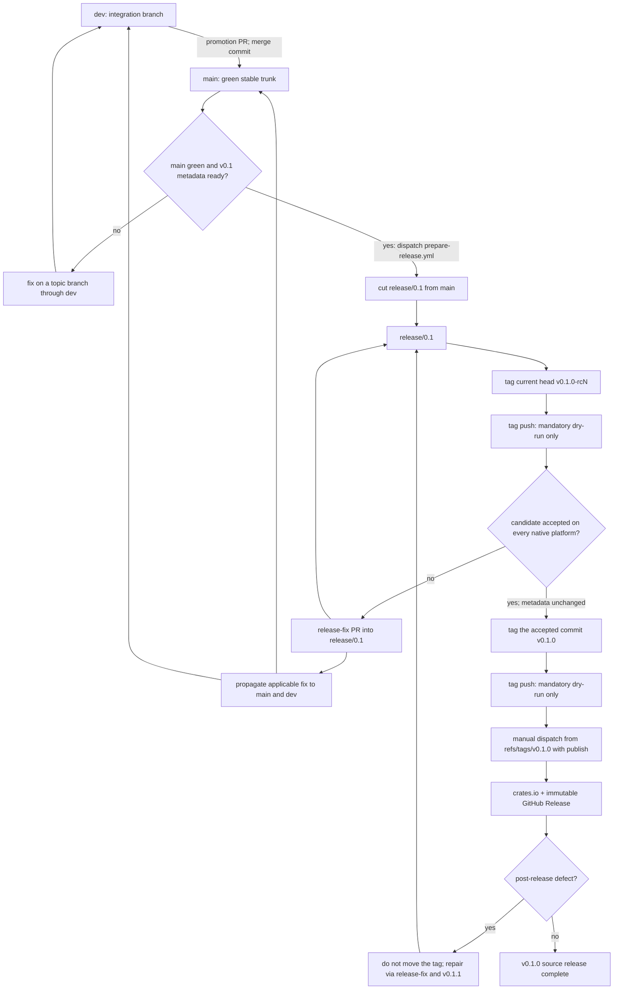
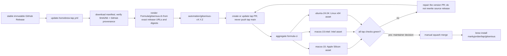

# Gitserious Release Posture

> Draft for the v0.1 release line. This document is canonical for release
> mechanics; repository rulesets and workflow code remain the enforcement
> surfaces.

## Posture at a Glance

Gitserious promotes changes through:

`dev → main → release/X.Y → vX.Y.Z-rcN → vX.Y.Z`

GitHub Actions artifacts are the private rehearsal surface, GitHub prereleases
are the public candidate surface, and immutable GitHub Releases are the stable
binary origin. The release process does not need a separate staging deployment
or a second binary store. `markyjordan/homebrew-tap` contains downstream package
metadata only; it never becomes the source of the binaries.

The design intentionally separates the reusable native builder in
[`build-release-binaries.yml`](../../.github/workflows/build-release-binaries.yml)
from orchestration in [`release.yml`](../../.github/workflows/release.yml). This
follows the useful boundary in uv while keeping build and policy logic in small,
fixture-tested scripts.

## Branch and Tag Promotion



`release/X.Y` is cut only from green `main`. RC and stable tags must point to
the current release-branch head. A stable tag may point to the same commit as
the accepted final RC. If the changelog, release notes, package metadata, or any
other release input changes after that RC, create another RC; do not silently
change the candidate beneath the stable tag.

Release fixes merge through `release-fix/*`, `fix/*`, or `hotfix/*` PRs. Apply
the same correction forward to `main` and `dev` when relevant. Never move or
replace a published tag.

## Native Artifact and Publication Flow

```mermaid
flowchart LR
  Ref["selected main, release/X.Y, or existing tag ref"] --> Ready["release request + readiness checks"]
  Ready --> Matrix["reusable native-four matrix"]
  Matrix --> Linux["Linux x64 .tar.gz"]
  Matrix --> MacIntel["macOS Intel .tar.gz"]
  Matrix --> MacArm["macOS Apple Silicon .tar.gz"]
  Matrix --> Windows["Windows x64 .zip"]
  Linux --> Smoke["execute each native binary"]
  MacIntel --> Smoke
  MacArm --> Smoke
  Windows --> Smoke
  Smoke --> Archives["archive binary + README + MIT + Apache-2.0 licenses"]
  Archives --> PerFile["sibling .sha256 files"]
  PerFile --> Assemble["assemble final bundle"]
  Assemble --> Manifest["release-manifest.json + SHA256SUMS"]
  Assemble --> Source["checksummed source archive"]
  Assemble --> Notes["release-notes.md + CHANGELOG.md"]
  Manifest --> Mode{"request mode and tag type"}
  Source --> Mode
  Notes --> Mode
  Mode -->|"tag=dry-run or tag push"| Actions["Actions artifact only; no external mutation"]
  Mode -->|"manual publish: RC"| AttestRC["SHA-pinned GitHub provenance attestations"]
  AttestRC --> Prerelease["one atomic GitHub prerelease create"]
  Mode -->|"manual publish: stable"| Crates["publish 5 crates in dependency order"]
  Crates --> AttestStable["SHA-pinned GitHub provenance attestations"]
  AttestStable --> StableRelease["one atomic immutable GitHub Release create"]
  Prerelease --> RCFailure{"candidate failure?"}
  RCFailure -->|"yes"| NewRC["fix release branch and issue a new RC tag"]
  StableRelease --> StableFailure{"stable failure?"}
  StableFailure -->|"yes"| Patch["yank or document if needed; issue a patch release"]
```



The native contract is:

| Runner | Rust target | GitHub asset |
| --- | --- | --- |
| `ubuntu-24.04` | `x86_64-unknown-linux-gnu` | `gitserious-x86_64-unknown-linux-gnu.tar.gz` |
| `macos-15-intel` | `x86_64-apple-darwin` | `gitserious-x86_64-apple-darwin.tar.gz` |
| `macos-15` | `aarch64-apple-darwin` | `gitserious-aarch64-apple-darwin.tar.gz` |
| `windows-2025` | `x86_64-pc-windows-msvc` | `gitserious-x86_64-pc-windows-msvc.zip` |

Each archive has a sibling `<archive>.sha256`. The final bundle also includes
`SHA256SUMS`, `release-manifest.json`, `release-notes.md`, `CHANGELOG.md`,
`package-files.txt`, and `gitserious-X.Y.Z-source.tar.gz`. The manifest binds the
tag, source commit, workspace version, locked Rust toolchain, exact target list,
filenames, and SHA256 digests.

The RC and stable publishers reject an existing GitHub Release. They verify the
complete bundle, then use one `gh release create <tag> <all-assets>` operation.
There is no upload/update/`--clobber` recovery path. GitHub provenance covers
the four native archives, source archive, and manifest.

Stable crate publication order is `gitserious-app`, `gitserious-cli`,
`gitserious-core`, `gitserious-fs`, then `gitserious`. A retry skips an already
indexed crate only after its crates.io archive checksum is shown to match the
locally packaged crate.

## Homebrew Handoff



[`update-homebrew-tap.yml`](../../.github/workflows/update-homebrew-tap.yml) is
both reusable and manually dispatchable. Stable publication calls it after the
GitHub Release exists; manual dispatch retries only this handoff. RCs cannot
enter the workflow.

The updater maps Apple Silicon, Intel macOS, and Intel Linux to their published
archives. Windows remains a direct-download platform. It is idempotent:

- tap `main` with the exact version and digests is already complete;
- an open `automation/gitserious-vX.Y.Z` PR is reused and updated;
- a different digest already associated with the version fails closed; and
- the updater has no path that pushes to tap `main`.

The source release is complete when crates.io and GitHub publication succeed.
Homebrew distribution is complete only after the generated PR passes all three
native tap jobs and the maintainer manually merges it. Formula repair happens in
another tap PR and never changes the immutable GitHub Release.

## Operator Procedure

### Rehearse from `main` or `release/X.Y`

1. Open the **Release** workflow and select `main` or the intended
   `release/X.Y` branch.
2. Dispatch with `tag=dry-run` and `release-mode=dry-run`.
3. Download the `dry-run-<run-id>-artifacts` Actions artifact.
4. Confirm the manifest commit/ref, all four archives, checksums, archive
   layouts, and native job results. Confirm no tag, GitHub Release, crates.io
   package, or tap branch was created.

### Publish an RC

1. Create `vX.Y.Z-rcN` at the current `release/X.Y` head and push it. The push
   can build only in dry-run mode.
2. Inspect the tag-push artifacts.
3. Select that exact tag in the workflow dispatcher and use
   `tag=vX.Y.Z-rcN`, `release-mode=publish`.
4. Approve the `release-candidate` environment. Verify the GitHub entry is a
   prerelease and that crates.io and the tap did not change.

### Publish stable

1. Tag the accepted final-RC commit `vX.Y.Z` without changing release inputs.
2. Inspect the mandatory tag-push dry run.
3. Select that tag and dispatch `tag=vX.Y.Z`, `release-mode=publish`.
4. Approve `crates-io-release`. Verify all five crates and the immutable GitHub
   Release before treating the source release as published.
5. Inspect the single generated tap PR. Merge it only after `formula-ci` passes.

## Direct Binary Installation and Verification

GitHub users select the archive for their OS and architecture. On macOS or
Linux, for example:

```sh
tag=v0.1.0
asset=gitserious-aarch64-apple-darwin.tar.gz
gh release download "$tag" --repo markyjordan/gitserious \
  --pattern "$asset" --pattern "${asset}.sha256"
shasum -a 256 -c "${asset}.sha256"
gh attestation verify "$asset" --repo markyjordan/gitserious
tar -xzf "$asset"
./gitserious
```

Choose `x86_64-apple-darwin` on Intel macOS or
`x86_64-unknown-linux-gnu` on Intel Linux. Windows x64 users download the
`.zip`, compare `Get-FileHash -Algorithm SHA256` with its sibling checksum, run
`gh attestation verify`, and expand the archive before executing
`gitserious.exe`.

## Homebrew Installation and Upgrade

Homebrew users do not manually select an architecture or digest:

```sh
brew install markyjordan/tap/gitserious
```

Normal upgrades use:

```sh
brew update
brew upgrade gitserious
```

The formula downloads the same immutable GitHub Release archives used by direct
installers; the tap does not build or host bottles.

## Hosted Controls

The source repository requires these environments:

| Environment | Purpose | Ref posture |
| --- | --- | --- |
| `release-management` | Cut `release/X.Y` from `main` | dispatch from protected default branch `dev`; script-enforced `main` base; maintainer approval |
| `release-candidate` | Publish a GitHub prerelease | exact release-line candidate pattern; maintainer approval |
| `crates-io-release` | Publish crates and stable GitHub Release | exact intended stable tag; maintainer approval; first-release token |
| `homebrew-tap-release` | Open/update the downstream tap PR | exact intended stable tag; maintainer approval; tap-only token |

`HOMEBREW_TAP_TOKEN` is a fine-grained token scoped only to
`markyjordan/homebrew-tap`, with Contents and Pull Requests read/write. It lives
only in `homebrew-tap-release`. The source repository also needs an active `v*`
tag ruleset that permits creation and prohibits update or deletion.

For the first release, the hosted policies are deliberately exact:
`v0.1.0-rc*` for candidates and `v0.1.0` for stable crates/Homebrew jobs. Advance
those policies to the next intended version as part of opening a new release
line; do not use a broad stable glob that also matches RC suffixes.

Use the existing protected crates.io token for the first publication because
the four component crate identities do not yet exist. After all five packages
exist, configure crates.io Trusted Publishing for subsequent versions and
remove the long-lived token.

Enable GitHub immutable releases after the atomic publisher reaches the default
branch and before `v0.1.0-rc1`. Do not enable it while the old mutable publisher
is still the hosted workflow implementation.

Tap `main` is PR-only with squash merges, required aggregate `formula-ci`,
conversation resolution, update/deletion protection, and zero required
approvals. Manual merge is still the solo-maintainer publication decision.
Automatically delete the version branch after merge.

## Baseline Recorded 2026-08-01

This table records the live hosted state before this release-posture change, so
the rollout gaps remain auditable even after the workflows land.

| Surface | Verified baseline | Required before first RC/stable |
| --- | --- | --- |
| Source branch protection | Active rulesets for `dev`, `main`, and `release/*` | Add the native-four builder to the protected promotion path |
| Source release controls | No environments; no `v*` tag ruleset; immutable releases disabled | Create four environments, activate tag immutability, then enable immutable Releases after merge |
| Release rehearsal | No release, prepare-release, or release-readiness runs | Complete `tag=dry-run` rehearsal from the intended release ref |
| GitHub distribution | No tags, Releases, or release assets | Publish and natively verify `v0.1.0-rc1` before stable |
| crates.io | Only `gitserious 0.0.0`; four component names absent | Publish all five v0.1.0 crates in dependency order; migrate later versions to Trusted Publishing |
| Homebrew tap | Hosted `main` has a placeholder README, no tracked formula, no CI, and no rulesets | Merge tap CI/rules first; stable release automation then opens the first formula PR |

## Hosted Rollout Status Recorded 2026-08-01

- The four source environments now exist with required maintainer review and
  custom branch/tag policies (`dev` for the trusted release-cut dispatcher,
  `v0.1.0-rc*`, and exact `v0.1.0` stable policies).
- The active source `release-tags` ruleset allows `v*` creation and rejects tag
  updates and deletions.
- Tap `main` is now PR-only, squash-only, protected against deletion and force
  update, requires conversation resolution and aggregate `formula-ci`, and
  deletes merged branches automatically.
- `CRATES_IO_TOKEN` and `HOMEBREW_TAP_TOKEN` are not yet present in their
  environments. They must be loaded before stable publication.
- Immutable GitHub Releases remain disabled until the atomic workflow change is
  merged. Release rehearsal, RC publication, and stable publication remain
  intentionally pending.

## Rollout and Acceptance

Before the first candidate:

1. Run every release/archive/CI fixture plus ShellCheck, actionlint, zizmor, and
   Rust check/fmt/lint/test/release checks.
2. Merge source and tap workflow changes; activate their hosted controls.
3. Add the two protected environment secrets and confirm dry runs are token-free.
4. Dispatch `tag=dry-run` and prove the run produces only Actions artifacts.
5. Enable immutable GitHub Releases.

For `v0.1.0-rc1`, verify all native archives on their own platforms, individual
and aggregate checksums, provenance, notes, prerelease status, and absence of
crates.io/Homebrew mutation. A failed candidate gets a new RC tag.

For `v0.1.0`, verify the five crate identities, four direct binaries, checksum
files, manifest, source archive, attestations, immutable tag/Release, and exactly
one tap PR. After its manual merge, test both a clean
`brew install markyjordan/tap/gitserious` and the ordinary upgrade path.

## References

- [uv reusable binary builder](https://github.com/astral-sh/uv/blob/79bbface771210df216b738e9bdc7df95e5a9e6b/.github/workflows/build-release-binaries.yml)
- [uv release orchestration](https://github.com/astral-sh/uv/blob/79bbface771210df216b738e9bdc7df95e5a9e6b/.github/workflows/release.yml)
- [GitHub artifact attestations](https://docs.github.com/en/actions/how-tos/secure-your-work/use-artifact-attestations/use-artifact-attestations)
- [GitHub immutable releases](https://docs.github.com/en/code-security/concepts/supply-chain-security/immutable-releases)
- [Homebrew tap maintenance](https://docs.brew.sh/How-to-Create-and-Maintain-a-Tap)
- [crates.io Trusted Publishing](https://blog.rust-lang.org/2025/07/11/crates-io-development-update-2025-07/)
