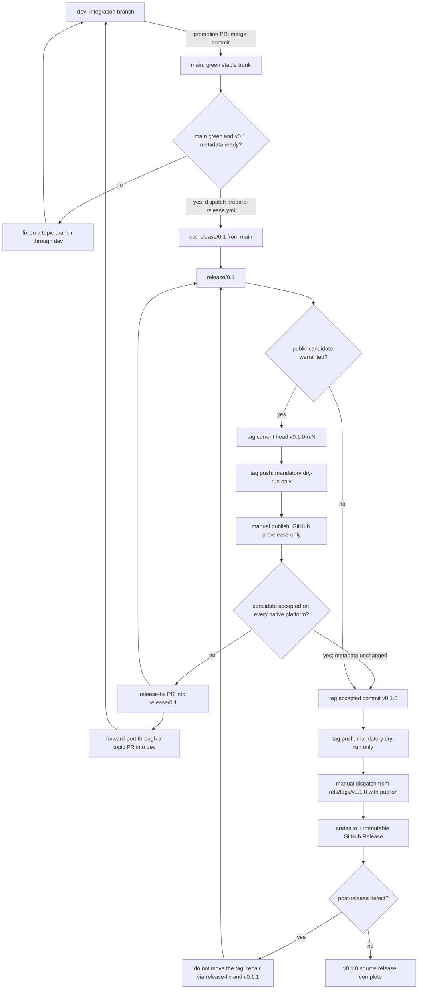
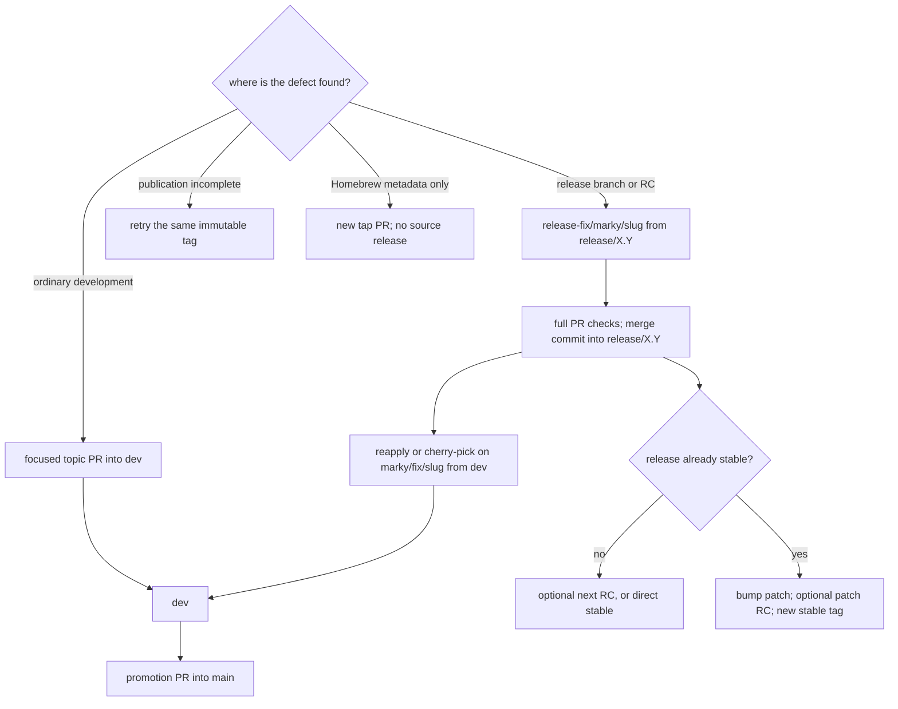
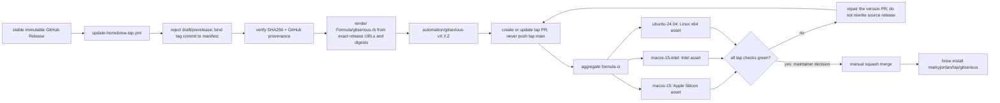

# Gitserious Release Posture

> Draft for the v0.1 release line. This document is canonical for release
> mechanics; repository rulesets and workflow code remain the enforcement
> surfaces.

## Posture at a Glance

Gitserious can promote changes through:

`dev → main → release/X.Y → [optional vX.Y.Z-rcN] → vX.Y.Z`

GitHub Actions artifacts are the private rehearsal surface, GitHub prereleases
are the public candidate surface, and immutable GitHub Releases are the stable
binary origin. The release process does not need a separate staging deployment
or a second binary store. `markyjordan/homebrew-tap` contains downstream package
metadata only; it never becomes the source of the binaries.

The design intentionally separates the reusable native builder in
[`build-release-binaries.yml`](../../.github/workflows/build-release-binaries.yml)
from orchestration in [`release.yml`](../../.github/workflows/release.yml). This
keeps native construction reusable across promotion and publication while
release policy remains in small, fixture-tested scripts.

## Branch and Tag Promotion



`release/X.Y` is cut only from green `main`. RC and stable tags must point to
the current release-branch head. RCs are optional: use one when public native
testing, compatibility risk, or release scope warrants an explicit candidate.
The mandatory tag-push dry run and manual publication approval still apply when
a stable release is published directly. If an RC is used, the stable tag should
point to the accepted RC commit. Any release-input change after acceptance
requires another RC if the release is still being represented as RC-validated.

Release fixes merge through `release-fix/*`, `fix/*`, or `hotfix/*` PRs. Use a
human-owned name such as `release-fix/marky/<slug>`. Apply the same correction
forward through a focused `marky/fix/<slug>` PR into `dev`, then promote `dev`
to `main`; do not merge a release branch directly into either protected branch.
Never move or replace a published tag.

## Fix, Candidate, and Patch Flow



A failed candidate is not rolled back. Merge the smallest compatible correction
into `release/X.Y`, forward-port it through `dev`, and either issue the next
unused `rcN` or proceed directly to stable when another public candidate is not
warranted. Never reuse an RC number.

A defective stable version is superseded. For example, a defect in `v0.1.0` is
fixed on `release/0.1`, recorded as `0.1.1`, and published as `v0.1.1` after the
ordinary dry-run and approval gates. `v0.1.1-rc1` is available but optional.
The same `release/0.1` branch serves the complete `0.1.x` maintenance line.

## Native Artifact and Publication Flow

```mermaid
flowchart LR
  Ref["selected main, release/X.Y, or existing tag ref"] --> Ready["release request + readiness checks"]
  Ready --> Matrix["reusable native-four matrix"]
  Matrix --> Linux["Linux x64 .tar.gz"]
  Matrix --> MacIntel["macOS Intel .tar.gz"]
  Matrix --> MacArm["macOS Apple Silicon .tar.gz"]
  Matrix --> Windows["Windows x64 .zip"]
  Linux --> Smoke["execute each native binary"]
  MacIntel --> Smoke
  MacArm --> Smoke
  Windows --> Smoke
  Smoke --> Archives["archive binary + README + MIT + Apache-2.0 licenses"]
  Archives --> PerFile["sibling .sha256 files"]
  PerFile --> Assemble["assemble final bundle"]
  Assemble --> Manifest["release-manifest.json + SHA256SUMS"]
  Assemble --> Source["checksummed source archive"]
  Assemble --> Notes["release-notes.md + CHANGELOG.md"]
  Manifest --> Verify["verify exact files, layouts, digests, tag, mode, and commit"]
  Source --> Verify
  Notes --> Verify
  Verify --> Mode{"request mode and tag type"}
  Mode -->|"tag=dry-run or tag push"| Actions["Actions artifact only; no external mutation"]
  Mode -->|"manual publish: RC"| AttestRC["SHA-pinned GitHub provenance attestations"]
  AttestRC --> Prerelease["one atomic GitHub prerelease create"]
  Mode -->|"manual publish: stable"| Crates["publish 5 crates in dependency order"]
  Crates --> AttestStable["SHA-pinned GitHub provenance attestations"]
  AttestStable --> StableRelease["one atomic immutable GitHub Release create"]
  Prerelease --> RCFailure{"candidate failure?"}
  RCFailure -->|"yes"| NewRC["fix release branch; choose next RC or stable"]
  StableRelease --> StableFailure{"stable failure?"}
  StableFailure -->|"yes"| Patch["yank or document if needed; issue a patch release"]
```



The native contract is:

| Runner | Rust target | GitHub asset |
| --- | --- | --- |
| `ubuntu-24.04` | `x86_64-unknown-linux-gnu` | `gitserious-X.Y.Z-x86_64-unknown-linux-gnu.tar.gz` |
| `macos-15-intel` | `x86_64-apple-darwin` | `gitserious-X.Y.Z-x86_64-apple-darwin.tar.gz` |
| `macos-15` | `aarch64-apple-darwin` | `gitserious-X.Y.Z-aarch64-apple-darwin.tar.gz` |
| `windows-2025` | `x86_64-pc-windows-msvc` | `gitserious-X.Y.Z-x86_64-pc-windows-msvc.zip` |

Candidate assets include the prerelease suffix, for example
`gitserious-0.1.0-rc1-aarch64-apple-darwin.tar.gz`. Untagged dry-runs use
the workspace version so their public bundle names rehearse the prospective
stable contract. The reusable native builder keeps versionless intermediate
names; final assembly assigns the versioned GitHub asset names.

The leading `v` belongs to the Git tag, not the asset filename. Keep the target
triple and real archive extension: `gitserious-v0.1.0-tar.gz` is rejected as a
public contract because it does not identify a platform and does not use a real
`.tar.gz` suffix. Do not add feature-profile suffixes unless the project
intentionally begins supporting multiple public binary variants.

Each archive has a sibling `<archive>.sha256`. The final bundle also includes
`SHA256SUMS`, `release-manifest.json`, `release-notes.md`, `CHANGELOG.md`,
`package-files.txt`, and a versioned source archive. Stable source uses
`gitserious-X.Y.Z-source.tar.gz`; an RC uses
`gitserious-X.Y.Z-rcN-source.tar.gz`. The archive root has the same versioned
name. The manifest binds the tag, source commit, workspace version, locked Rust
toolchain, exact target list, filenames, and SHA256 digests.

After assembly, the workflow writes a release authorization summary containing
the requested ref, tag and release-branch commit, classification, version,
toolchain, native targets, stable crate order, and manifest digest. Review that
summary before approving either protected publication environment.

The assembled bundle is verified before it becomes an Actions artifact and
again after the protected publication job downloads it. Verification requires
the exact fourteen-file bundle, canonical four-target order and archive
layouts, individual and aggregate digests, tag/mode/commit alignment, source
archive prefix, changelog heading, and manifest schema. The RC and stable
publishers repeat that verification and reject an existing GitHub Release before
using one `gh release create <tag> <all-assets>` operation. There is no
upload/update/`--clobber` recovery path. GitHub provenance names the four native
archives explicitly and also covers the source archive, aggregate checksum
index, and manifest.

Stable crate publication order is `gitserious-app`, `gitserious-cli`,
`gitserious-core`, `gitserious-fs`, then `gitserious`. A retry skips an already
indexed crate only after its crates.io archive checksum is shown to match the
locally packaged crate.

## Changelog and Release Notes

`CHANGELOG.md` is manually curated and is the canonical user-facing release
history. The pipeline does not generate changelog prose from commits or pull
requests. During bundle assembly, it mechanically extracts the exact
`## [X.Y.Z]` section into `release-notes.md`; GitHub publication uses that file
without generating a competing set of notes.

Use the following policy:

- Record notable user-facing work under `Unreleased`; internal refactors and
  mechanical CI-only changes need entries only when they affect users or
  operators.
- Group entries as applicable under `Added`, `Changed`, `Deprecated`,
  `Removed`, `Fixed`, and `Security`.
- During version preparation, move the applicable entries into
  `## [X.Y.Z] - TBD` and leave `Unreleased` ready for subsequent development.
- An exploratory RC may retain `TBD`. Before an RC can be treated as the exact
  accepted stable commit, replace it with the intended ISO `YYYY-MM-DD` date.
  Direct stable publication also requires that finalized date.
- Any changelog, release-note, license, package metadata, or other bundled input
  change after an accepted RC means the previous RC no longer represents the
  stable bits. Use another RC if retaining RC validation matters.
- A patch gets its own `X.Y.(Z+1)` section. If a version is yanked, preserve its
  history and mark its disposition rather than deleting the entry.

GitHub-generated release notes may later provide a contributor appendix, but
they do not replace the curated changelog or the extracted `release-notes.md`.

## Feature Flag Policy

Gitserious currently defines no Cargo features and no runtime feature flags.
Do not introduce flags speculatively: every flag creates another behavioral or
build configuration that must be owned, tested, documented, and eventually
graduated or removed.

| Mechanism | Use it for | Release posture |
| --- | --- | --- |
| Cargo feature | Optional dependency or compile-time capability | Additive where possible; one documented canonical feature set builds the public binaries |
| Runtime flag | Experimental user-visible behavior in the same binary | Off by default, locally opted in through a command/config/environment setting, with a safe fallback |
| RC | Testing an entire prospective release | Optional public distribution channel, not a feature flag and not percentage rollout |

The current Rust quality lane exercises `--all-features`, while native release
jobs build the default feature set. Before adding the first Cargo feature:

1. Record its purpose, default, owner, compatibility promise, and graduation or
   removal condition.
2. Define it at the public package boundary and propagate only the required
   dependency features.
3. Test the default, no-default, all-feature, and canonical release
   configurations in proportion to the supported combinations.
4. Pass the canonical set explicitly to the native builder and record it in
   `release-manifest.json` so a published digest is tied to its build features.
5. Keep GitHub and Homebrew on that one canonical build. Additional public
   feature variants require a separately designed naming and support contract.

Prefer runtime gating for experimental commands that should be available in the
ordinary binary. Such behavior must be visibly experimental, disabled by
default, testable both on and off, and recorded in the changelog. Remote or
percentage-based rollout infrastructure is not justified for this local CLI.

## Homebrew Handoff



[`update-homebrew-tap.yml`](../../.github/workflows/update-homebrew-tap.yml) is
both reusable and manually dispatchable. Stable publication calls it after the
GitHub Release exists; manual dispatch retries only this handoff. RCs cannot
enter the workflow.

Before accessing the tap token, the handoff queries the source release and
rejects drafts, prereleases, mismatched tags, non-publish manifests, unexpected
release URLs, and any stable tag commit that differs from the manifest source
commit. It then verifies GitHub provenance and each published archive digest.
The cross-repository credential is exposed only after those source-identity
checks pass.

The updater maps Apple Silicon, Intel macOS, and Intel Linux to their published
archives. Windows remains a direct-download platform. It is idempotent:

- tap `main` with the exact version and digests is already complete;
- an open `automation/gitserious-vX.Y.Z` PR is reused and updated;
- a different digest already associated with the version fails closed; and
- the updater has no path that pushes to tap `main`.

The source release is complete when crates.io and GitHub publication succeed.
Homebrew distribution is complete only after the generated PR passes all three
native tap jobs and the maintainer manually merges it. Formula repair happens in
another tap PR and never changes the immutable GitHub Release.

Tap CI uses SHA-pinned Actions, rejects placeholder digests, runs `brew style`,
performs `brew audit --strict --online`, installs the exact published binary,
runs `brew test`, and directly executes the installed program on Apple Silicon,
Intel macOS, and Linux x64. Once gitserious has a stable functional command, the
formula `test do` block must exercise that behavior and assert meaningful output;
an exit-only placeholder or `--version` check is not the long-term acceptance
test.

The fine-grained tap token is acceptable for the first release. A later
hardening step may replace it with a short-lived GitHub App installation token;
that migration is not a v0.1 publication gate.

## Operator Procedure

### Cut a release line

Cut `release/X.Y` only when the product scope is ready for stabilization:

1. Finish the intended workspace version and draft changelog section on a topic
   branch, merge it through `dev`, and promote the exact green `dev` state to
   `main` with a regular merge commit.
2. Dispatch **Release** from `main` with `tag=dry-run` and
   `release-mode=dry-run`; inspect the complete bundle and confirm that every
   publication job skipped.
3. Dispatch **Prepare Release** from the repository default branch with
   `version-family=X.Y` and approve `release-branch-management`.
4. The protected workflow re-reads `main`, fails if it moved or the branch
   already exists, and creates `release/X.Y` at the exact `main` commit.
5. Confirm the new release-branch head and tree match `main`, then repeat the
   token-free dry run from `release/X.Y`.

The `release-branch-management` deployment entry is the audit record for a
protected ref mutation. It does not represent a deployed application or a
published gitserious release.

### Rehearse from `main` or `release/X.Y`

1. Open the **Release** workflow and select `main` or the intended
   `release/X.Y` branch.
2. Dispatch with `tag=dry-run` and `release-mode=dry-run`.
3. Download the `dry-run-<run-id>-artifacts` Actions artifact.
4. Confirm the manifest commit/ref, all four archives, checksums, archive
   layouts, and native job results. Confirm no tag, GitHub Release, crates.io
   package, or tap branch was created.

### Publish an optional RC

Use an RC when the release benefits from public candidate testing. Finalize the
workspace version, changelog, and every other release input before the candidate
that may become stable. Starting from a clean release-branch checkout, choose
the next unused monotonically increasing `rcN` and create an annotated, signed
tag at the exact branch head:

```sh
release_line=0.1
tag=v0.1.0-rc1

git fetch origin --prune --tags
git switch "release/${release_line}"
git pull --ff-only origin "release/${release_line}"
test -z "$(git status --porcelain)"

RELEASE_REF="release/${release_line}" RELEASE_MODE=dry-run RELEASE_TAG= \
  bash scripts/release/check-release.sh

commit="$(git rev-parse HEAD)"
git tag -s "$tag" "$commit" -m "gitserious ${tag}"
git tag -v "$tag"
test "$(git rev-parse "${tag}^{commit}")" = "$commit"
git push origin "refs/tags/${tag}"
```

The tag push can build only in dry-run mode. Inspect its artifacts and release
authorization summary. Then select that exact tag in the workflow dispatcher
and enter the same `tag` with `release-mode=publish`. The publish run reassembles
the bundle from the immutable tag before it pauses at `release-candidate`.
Before approving that environment, inspect the publish run's authorization
summary and `vX.Y.Z-rcN-<run-id>-artifacts`; the manifest digest in the summary
must match the downloaded bundle. Approval releases only the verified bundle to
explicit provenance attestation and atomic prerelease creation. Verify the
GitHub entry is a prerelease and that crates.io and the tap did not change.

### Publish stable

Stable publication does not require an RC. If an RC was accepted, use its exact
commit; otherwise use the current release-branch head after its successful
token-free dry run. In both cases, finalize the stable changelog date before
creating the tag.

```sh
tag=v0.1.0

git fetch origin --prune --tags
git switch release/0.1
git pull --ff-only origin release/0.1
test -z "$(git status --porcelain)"

release_commit="$(git rev-parse HEAD)"

# If an RC was used, verify it before tagging stable:
# accepted_rc=v0.1.0-rc1
# test "$(git rev-parse "${accepted_rc}^{commit}")" = "$release_commit"

git tag -s "$tag" "$release_commit" -m "gitserious ${tag}"
git tag -v "$tag"
test "$(git rev-parse "${tag}^{commit}")" = "$release_commit"
git push origin "refs/tags/${tag}"
```

Inspect the mandatory tag-push dry run and its authorization summary. Select
that exact tag and dispatch `tag=v0.1.0`, `release-mode=publish`. Approve
`crates-io-release`, then verify all five crates and the immutable GitHub
Release before treating the source release as published. Inspect the single
generated tap PR and merge it only after `formula-ci` passes.

### Publish a patch

For a source, binary, or crate defect in `vX.Y.Z`:

1. Branch `release-fix/marky/<slug>` from `release/X.Y` and make the smallest
   compatible correction.
2. Bump the workspace and workspace-dependency versions to `X.Y.(Z+1)`, update
   `Cargo.lock`, and add a curated patch changelog section.
3. Merge through a regular release-fix PR after release readiness and all four
   native jobs pass.
4. Forward-port the correction through a focused topic PR into `dev`, then the
   normal `dev` to `main` promotion.
5. Choose whether the patch warrants `vX.Y.(Z+1)-rc1`. The candidate is optional;
   the stable tag-push dry run and manual stable approval are not.
6. Publish `vX.Y.(Z+1)` and let the normal stable handoff update crates.io,
   GitHub Releases, and Homebrew.

Yank an affected crate only when continued dependency resolution creates real
user or security harm. Yanking does not replace the patch release.

### Recover from partial publication

Stable publication is sequential across crates.io, GitHub Releases, and the
Homebrew handoff. Recovery never moves a tag and never changes release inputs:

- If one or more crates were indexed but a later crate failed, re-dispatch
  `release-mode=publish` from the same stable tag. The publisher skips a crate
  only after its indexed archive checksum matches the locally packaged crate.
- If all crates were indexed but GitHub Release creation failed, re-dispatch
  from the same stable tag. The same identity checks run before the publisher
  retries the one atomic GitHub Release creation.
- If the immutable GitHub Release exists but the Homebrew handoff failed, do
  not rerun stable publication. Manually dispatch **Update Homebrew Tap** from
  the same stable tag; it reuses or updates the versioned tap PR.
- If published RC or stable assets are defective, do not replace them. A failed
  candidate may get the next RC tag after its correction; a stable defect gets
  a patch release.

The operational rule is: rerun the same immutable tag to finish an incomplete
downstream transaction. Never retag or bump merely to recover a transient
publication failure.

| Failure class | Correct response | New version? |
| --- | --- | --- |
| RC behavior or candidate artifact is bad | Merge a release fix; optionally publish the next RC | No stable version has been committed yet |
| Stable source, binary, or crate is bad | Publish `vX.Y.(Z+1)` from the release line | Yes |
| Crates/GitHub transaction stopped before completion | Re-dispatch the same stable tag after identity checks | No |
| GitHub Release exists but tap handoff failed | Re-dispatch **Update Homebrew Tap** for the same tag | No |
| Published binaries are good but formula metadata is bad | Repair through a new tap PR | No |

## Direct Binary Installation and Verification

GitHub users select the archive for their OS and architecture. On macOS or
Linux, for example:

```sh
tag=v0.1.0
asset=gitserious-0.1.0-aarch64-apple-darwin.tar.gz
gh release download "$tag" --repo markyjordan/gitserious \
  --pattern "$asset" --pattern "${asset}.sha256"
shasum -a 256 -c "${asset}.sha256"
gh attestation verify "$asset" --repo markyjordan/gitserious
tar -xzf "$asset"
./gitserious
```

Choose `x86_64-apple-darwin` on Intel macOS or
`x86_64-unknown-linux-gnu` on Intel Linux. Windows x64 users download the
`.zip`, compare `Get-FileHash -Algorithm SHA256` with its sibling checksum, run
`gh attestation verify`, and expand the archive before executing
`gitserious.exe`.

## Homebrew Installation and Upgrade

Homebrew users do not manually select an architecture or digest:

```sh
brew install markyjordan/tap/gitserious
```

Normal upgrades use:

```sh
brew update
brew upgrade gitserious
```

The formula downloads the same immutable GitHub Release archives used by direct
installers; the tap does not build or host bottles.

## Hosted Controls

The source repository requires these environments:

| Environment | Purpose | Ref posture |
| --- | --- | --- |
| `release-branch-management` | Cut `release/X.Y` from `main` | dispatch from protected default branch `dev`; script-enforced `main` base; maintainer approval |
| `release-candidate` | Publish a GitHub prerelease | exact release-line candidate pattern; maintainer approval |
| `crates-io-release` | Publish crates and stable GitHub Release | exact intended stable tag; maintainer approval; first-release token |
| `homebrew-tap-release` | Open/update the downstream tap PR | exact intended stable tag; maintainer approval; tap-only token |

`HOMEBREW_TAP_TOKEN` is a fine-grained token scoped only to
`markyjordan/homebrew-tap`, with Contents and Pull Requests read/write. It lives
only in `homebrew-tap-release`. The source repository also needs an active `v*`
tag ruleset that permits creation and prohibits update or deletion.

For the first release, the hosted policies are deliberately exact:
`v0.1.0-rc*` for optional candidates and `v0.1.0` for stable crates/Homebrew
jobs. Before every later target version—including a patch on the existing
release line—advance those policies to the exact candidate series and stable
tag. Do not use a broad stable glob that also matches RC suffixes.

Use the existing protected crates.io token for the first publication because
the four component crate identities do not yet exist. After all five packages
exist, configure crates.io Trusted Publishing for subsequent versions and
remove the long-lived token.

Immutable GitHub Releases are enabled for the repository. GitHub applies that
control only to releases created after enablement, so it must remain active for
every RC and stable publication.

Tap `main` is PR-only with squash merges, required aggregate `formula-ci`,
strict up-to-date status enforcement, conversation resolution, update/deletion
protection, and zero required approvals. Manual merge is still the
solo-maintainer publication decision. Automatically delete the version branch
after merge.

Both repositories require full commit SHA references for Actions. Source
workflows allow GitHub-owned Actions plus the explicitly selected
`zizmorcore/zizmor-action`; the tap allows GitHub-owned Actions plus
`Homebrew/actions/setup-homebrew`. Local reusable workflows remain allowed.

## Current State Recorded 2026-08-05

| Surface | Verified current state | Remaining gate |
| --- | --- | --- |
| Source branch protection | Active rulesets protect `dev`, `main`, and `release/*`. Promotion CI runs all four native builders; `main` and `release/*` also require release readiness. | None for branch promotion. |
| Source release controls | Four reviewed environments have exact branch/tag policies. `release-candidate` accepts only `v0.1.0-rc*`; the active `release-tags` ruleset permits `v*` creation and rejects updates and deletions. The repository immutable-Releases endpoint reports `enabled: true`. | Preserve these controls through the first candidate or direct stable publication. |
| Actions trust | Source and tap Actions are constrained to full commit SHA references and selected GitHub, zizmor, and Homebrew action owners. Workflow permissions default to read-only. | Review and deliberately admit any new third-party Action before use. |
| Release rehearsal | [Run 31073157623](https://github.com/markyjordan/gitserious/actions/runs/31073157623) succeeded from promoted `main` commit `e76b7eb0201811d4570001c2adbd2ca422945a10`: request validation, release readiness, all four native builds and executions, aggregate `native-four`, versioned bundle assembly, exact-layout verification, and local Intel-macOS execution passed. Every publication job skipped. The run produced only Actions artifacts, and all individual and aggregate checksums verified. | No immediate release action. Repeat from `release/0.1` only after the v0.1 product scope is ready for stabilization and that branch is intentionally cut. |
| GitHub distribution | No source tags, Releases, or published release assets exist. Candidate, crates.io, and Homebrew publication deployments remain absent. Cancelled Prepare Release run [30870110509](https://github.com/markyjordan/gitserious/actions/runs/30870110509) left one `release-branch-management` audit record but executed no steps and created no branch. | Continue normal product development. When v0.1 is feature-ready, cut `release/0.1` and choose an optional RC or direct stable path; this posture does not imply a release date. |
| crates.io | `gitserious 0.0.0` exists; `gitserious-app`, `gitserious-cli`, `gitserious-core`, and `gitserious-fs` do not. `crates-io-release` has no secret. | Load the protected first-publication token before stable; migrate later versions to Trusted Publishing. |
| Homebrew tap | Tap PR [#1](https://github.com/markyjordan/homebrew-tap/pull/1) is merged. Three-platform `formula-ci` is required and must be up to date with tap `main`; its ruleset has no bypass. No formula exists before the first stable release. `homebrew-tap-release` has no secret. | Load the tap-only token before stable. Replace the exit-only formula test with a meaningful functional assertion once the product exposes stable behavior. |

## Rollout and Acceptance

When the v0.1 product scope is feature-ready and stabilization begins, complete
these gates before the first public candidate or stable publication. They are
not a signal to cut a release branch during ongoing product development:

1. Run every release/archive/CI fixture plus ShellCheck, actionlint, zizmor, and
   Rust check/fmt/lint/test/release checks.
2. Merge the release-ready product and any remaining source hardening through
   `dev`, then promote that exact state to `main` with a regular merge commit.
3. Confirm the immutable-Releases endpoint still reports `enabled: true`.
4. Cut `release/0.1` from green `main` and repeat the token-free dry run there.

Before stable publication, add `CRATES_IO_TOKEN` and `HOMEBREW_TAP_TOKEN` only
to their protected environments. RC publication intentionally requires neither
credential.

If `v0.1.0-rc1` is used, verify all native archives on their own platforms,
individual and aggregate checksums, provenance, notes, prerelease status, and
absence of crates.io/Homebrew mutation. A failed candidate may be superseded by
the next unused RC tag after its correction; RC publication remains optional.

For `v0.1.0`, verify the five crate identities, four direct binaries, checksum
files, manifest, source archive, attestations, immutable tag/Release, and exactly
one tap PR. After its manual merge, test both a clean
`brew install markyjordan/tap/gitserious` and the ordinary upgrade path.

## References

- [Keep a Changelog](https://keepachangelog.com/en/1.1.0/)
- [Cargo feature reference](https://doc.rust-lang.org/cargo/reference/features.html)
- [GitHub generated release notes](https://docs.github.com/en/repositories/releasing-projects-on-github/automatically-generated-release-notes)
- [GitHub artifact attestations](https://docs.github.com/en/actions/how-tos/secure-your-work/use-artifact-attestations/use-artifact-attestations)
- [GitHub immutable releases](https://docs.github.com/en/code-security/concepts/supply-chain-security/immutable-releases)
- [GitHub Actions policy controls](https://docs.github.com/en/repositories/managing-your-repositorys-settings-and-features/enabling-features-for-your-repository/disabling-or-limiting-github-actions-for-a-repository)
- [Homebrew tap maintenance](https://docs.brew.sh/How-to-Create-and-Maintain-a-Tap)
- [Homebrew Formula Cookbook](https://docs.brew.sh/Formula-Cookbook)
- [crates.io Trusted Publishing](https://blog.rust-lang.org/2025/07/11/crates-io-development-update-2025-07/)
